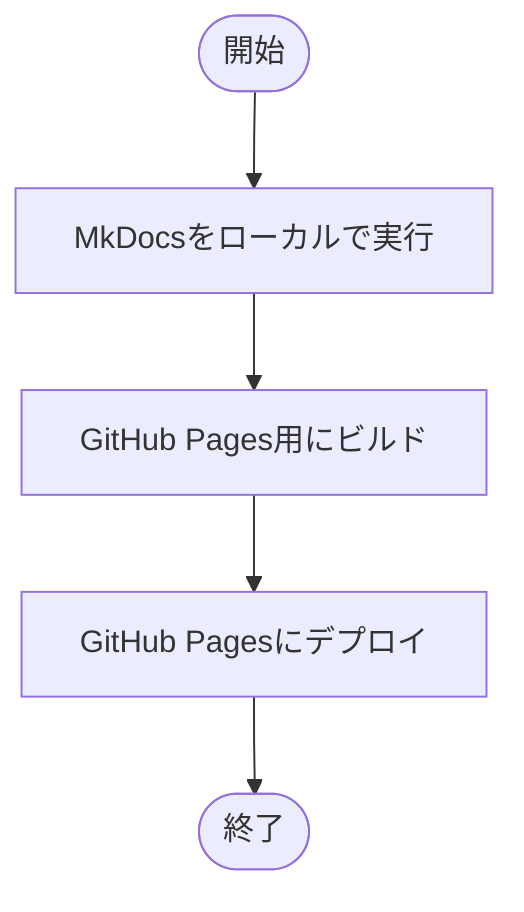

# Go-DDDマーケットプレイスアプリケーション

## 1. 概要

Go-DDDマーケットプレイスアプリケーションは、ドメイン駆動設計（Domain-Driven Design, DDD）の原則に従って構築されたGoアプリケーションです。このセットアップガイドでは、開発環境の構築から、アプリケーションの実行、テストまでの一連の手順を説明します。


## 2. 前提条件

Go-DDDマーケットプレイスアプリケーションを構築するには、以下のソフトウェアが必要です：

| ソフトウェア | バージョン | 備考 |
| :----------- |:------| :--- |
| Go           | 1.23  | プログラミング言語 |
| Docker       | 最新  | コンテナ化 |
| Docker Compose | 最新 | マルチコンテナ管理 |
| Git          | 最新  | バージョン管理 |
| Node.js      | 20.x  | フロントエンド開発 |

## 3. セットアップ手順

以下のステップに従って、Go-DDDマーケットプレイスアプリケーションを構築します。


### 3.1 前提条件のインストール

各プラットフォームに応じて、必要なソフトウェアをインストールします。

#### 3.1.1 Go のインストール


**macOS**:
```bash
brew install go
```

**Linux (Ubuntu/Debian)**:
```bash
sudo apt-get update
sudo apt-get install golang-go
```

**Windows**:
1. [Go公式サイト](https://golang.org/dl/)からインストーラーをダウンロード
2. インストーラーを実行し、指示に従う

インストールを確認:
```bash
go version
```

#### 3.1.2 Docker と Docker Compose のインストール


**macOS & Windows**:
1. [Docker Desktop](https://www.docker.com/products/docker-desktop)をダウンロードしてインストール

**Linux (Ubuntu/Debian)**:
```bash
sudo apt-get update
sudo apt-get install docker.io docker-compose
```

インストールを確認:
```bash
docker --version
docker-compose --version
```

#### 3.1.3 Node.js のインストール


**macOS**:
```bash
brew install node@20
```

**Linux (Ubuntu/Debian)**:
```bash
curl -fsSL https://deb.nodesource.com/setup_20.x | sudo -E bash -
sudo apt-get install -y nodejs
```

**Windows**:
1. [Node.js公式サイト](https://nodejs.org/)からインストーラーをダウンロード
2. インストーラーを実行し、指示に従う

インストールを確認:
```bash
node --version
npm --version
```

### 3.2 リポジトリのクローン


リポジトリをクローンし、プロジェクトディレクトリに移動します：

```bash
git clone https://github.com/yourusername/go-ddd.git
cd go-ddd
```

### 3.3 依存関係のインストール


Node.js の依存関係をインストールします：

```bash
npm install
```

Go の依存関係をダウンロードします：

```bash
go mod download
```

### 3.4 開発環境の起動


Docker Compose を使用して、開発環境を起動します：

```bash
docker-compose up -d
```

起動したサービスを確認します：

```bash
docker-compose ps
```

以下のサービスが起動します：
- PostgreSQL (ポート 9920)
- MySQL (ポート 3306)
- Wiki.js (ポート 80)
- PlantUML Server (ポート 9999)
- MkDocs (ポート 8000)

### 3.5 データベースのセットアップ


アプリケーションは起動時に自動的にデータベースマイグレーションを実行します。データベース接続情報は以下の通りです：

**PostgreSQL**:
- ホスト: localhost
- ポート: 9920
- ユーザー: root
- パスワード: password
- データベース: mydb

### 3.6 アプリケーションの構築


アプリケーションをビルドします：

```bash
go build -o app/backend/cmd/marketplace/marketplace app/backend/cmd/marketplace/main.go
```

### 3.7 アプリケーションの実行


ビルドしたアプリケーションを実行します：

```bash
./app/backend/cmd/marketplace/marketplace
```

アプリケーションはデフォルトでポート9090で起動します。ヘルスチェックエンドポイントにアクセスして、アプリケーションが正常に動作していることを確認します：

```
http://localhost:9090/api/v1/health
```

### 3.8 テストの実行


テストを実行します：

```bash
cd app/backend
go test ./...
```

## 4. アプリケーション構造

Go-DDDマーケットプレイスアプリケーションは、ドメイン駆動設計の原則に従って、以下のレイヤーで構成されています：


### 4.1 プロジェクト構造

```
go-ddd/
├── app/
│   └── backend/
│       ├── cmd/
│       │   └── marketplace/
│       │       └── main.go
│       └── internal/
│           ├── domain/
│           │   ├── entities/
│           │   └── repositories/
│           ├── application/
│           │   ├── services/
│           │   ├── command/
│           │   └── query/
│           ├── infrastructure/
│           │   └── db/
│           └── interface/
│               └── api/
│                   └── rest/
├── docs/
│   └── wiki/
├── ops/
│   └── docker/
└── docker-compose.yml
```

### 4.2 主要なコンポーネント

#### 4.2.1 ドメインレイヤー

ドメインレイヤーはアプリケーションの中心であり、ビジネスロジックとルールを含みます。

- **エンティティ**: 商品（Product）や出品者（Seller）などのビジネスオブジェクト
- **リポジトリインターフェース**: データの永続化を担当するインターフェース

#### 4.2.2 アプリケーションレイヤー

アプリケーションレイヤーはユースケースを実装し、ドメインレイヤーのオブジェクトを調整します。

- **サービス**: 商品サービスや出品者サービスなど、ユースケースを実装するサービス
- **コマンド**: ドメインの状態を変更する操作（書き込み操作）
- **クエリ**: ドメインから情報を取得する操作（読み取り操作）

#### 4.2.3 インフラストラクチャレイヤー

インフラストラクチャレイヤーは、永続化やその他の技術的な関心事を処理します。

- **データベース実装**: リポジトリインターフェースのデータベース実装（GORM を使用）

#### 4.2.4 インターフェースレイヤー

インターフェースレイヤーは、外部世界とのインタラクションを処理します。

- **REST API**: 商品や出品者に関するREST APIエンドポイントを提供

## 5. API エンドポイント

Go-DDDマーケットプレイスアプリケーションは、以下のREST APIエンドポイントを提供します：


### 5.1 商品 API

| メソッド | エンドポイント | 説明 |
|---------|--------------|------|
| POST | /api/v1/products | 新しい商品を作成 |
| GET | /api/v1/products | すべての商品を取得 |
| GET | /api/v1/products/{id} | 指定IDの商品を取得 |
| PUT | /api/v1/products/{id} | 指定IDの商品を更新 |

### 5.2 出品者 API

| メソッド | エンドポイント | 説明 |
|---------|--------------|------|
| POST | /api/v1/sellers | 新しい出品者を作成 |
| GET | /api/v1/sellers | すべての出品者を取得 |
| GET | /api/v1/sellers/{id} | 指定IDの出品者を取得 |
| PUT | /api/v1/sellers/{id}/name | 指定IDの出品者の名前を更新 |
| PUT | /api/v1/sellers/{id}/email | 指定IDの出品者のメールアドレスを更新 |
| DELETE | /api/v1/sellers/{id} | 指定IDの出品者を削除 |

### 5.3 システム API

| メソッド | エンドポイント | 説明 |
|---------|--------------|------|
| GET | /api/v1/health | ヘルスチェック |

## 6. トラブルシューティング


### 6.1 よくある問題と解決策

#### データベース接続エラー

**症状**: アプリケーション起動時に「Failed to connect to database」などのエラーが表示される

**解決策**:
1. Docker Composeが起動しているか確認: `docker-compose ps`
2. データベース接続情報が正しいか確認
3. データベースコンテナに直接接続してみる: `docker-compose exec db_postgresql psql -U root -d mydb`

#### ビルドエラー

**症状**: `go build` コマンド実行時にエラーが発生する

**解決策**:
1. Go依存関係が正しくインストールされているか確認: `go mod download`
2. 依存関係を整理: `go mod tidy`
3. Goのバージョンが1.23以上であることを確認: `go version`

#### 実行時エラー

**症状**: アプリケーション実行時にエラーが発生する

**解決策**:
1. ログを確認して具体的なエラーメッセージを特定
2. データベースマイグレーションが成功したか確認
3. 必要なテーブルがデータベースに作成されているか確認

## 7. ドキュメント

Go-DDDマーケットプレイスアプリケーションのドキュメントは、MkDocsを使用してGitHub Pagesに公開することができます。



### 7.1 MkDocsの使用

MkDocsは、Markdownファイルからドキュメントサイトを生成するためのツールです。Docker Composeを使用して、MkDocsサーバーを起動できます：

```bash
docker-compose up -d mkdocs
```

MkDocsサーバーは、ポート8000で起動します。ブラウザで以下のURLにアクセスして、ドキュメントを表示できます：

```
http://localhost:8000
```

### 7.2 GitHub Pagesへのデプロイ

wikiフォルダのMarkdownファイルからGitHub Pagesサイトを生成し、デプロイするには、以下のスクリプトを実行します：

```bash
./ops/docker/mkdocs/deploy-gh-pages.sh
```

このスクリプトは以下の処理を行います：
1. MkDocsサイトをビルド
2. gh-pagesブランチを作成または切り替え
3. ビルドしたサイトをgh-pagesブランチにコピー
4. 変更をコミットしてGitHubにプッシュ

デプロイが完了すると、以下のURLでドキュメントサイトにアクセスできます：

```
https://yourusername.github.io/go-ddd/
```

### 7.3 MkDocsの設定

MkDocsの設定は、プロジェクトルートの`mkdocs.yml`ファイルで行います。このファイルでは、サイト名、テーマ、ナビゲーション構造などを設定できます。

現在の設定では、Material for MkDocsテーマを使用し、以下の機能を有効にしています：

- **Mermaidダイアグラム**: Markdown内で`mermaid`コードブロックを使用してフローチャート、シーケンス図、ガントチャートなどを作成できます
- **PlantUMLダイアグラム**: Markdown内で`plantuml`コードブロックを使用してUML図を作成できます（Docker環境のPlantUMLサーバーを使用）
- **カスタムスタイル**: ダイアグラムの表示を最適化するためのカスタムCSSスタイル

ダイアグラムの使用例は、ドキュメントサイトの「Diagram Examples」ページで確認できます。

## 8. まとめ

このセットアップガイドでは、Go-DDDマーケットプレイスアプリケーションを０から構築するための手順を説明しました。ドメイン駆動設計の原則に従って構築されたこのアプリケーションは、クリーンアーキテクチャを採用し、各レイヤーが明確に分離されています。


**環境構築**:
- 前提条件のインストール
- リポジトリのクローン
- 依存関係のインストール
- 開発環境の起動

**アプリケーション開発**:
- データベースのセットアップ
- アプリケーションの構築
- アプリケーションの実行

**テスト**:
- テストの実行
- APIエンドポイントの確認

**デプロイ**:
- 本番環境へのデプロイ
- 監視とメンテナンス

このガイドに従うことで、Go-DDDマーケットプレイスアプリケーションを簡単に構築し、実行することができます。また、ドメイン駆動設計の原則を学び、実践するための良い例としても活用できます。

## 8. プロジェクト計画

Go-DDDマーケットプレイスアプリケーションの開発計画は以下のドキュメントで詳細に定義されています：

- [機能一覧](docs/wiki/feature_list.md) - アプリケーションの機能一覧
- [ユーザーストーリー](docs/wiki/user_stories.md) - ユーザーストーリー
- [リリースプラン](docs/wiki/release_plan.md) - リリースプラン
- [イテレーションプラン](docs/wiki/iteration_plan.md) - イテレーションプラン

## 9. 参考リンク

- [Go公式ドキュメント](https://golang.org/doc/)
- [Docker公式ドキュメント](https://docs.docker.com/)
- [GORM公式ドキュメント](https://gorm.io/docs/)
- [Echo Framework公式ドキュメント](https://echo.labstack.com/guide/)
- [ドメイン駆動設計リファレンス](https://www.domainlanguage.com/ddd/reference/)
